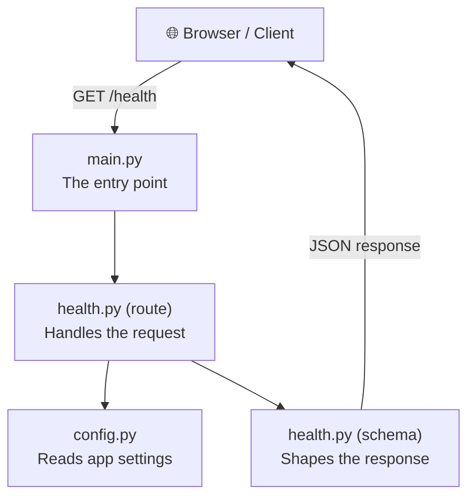
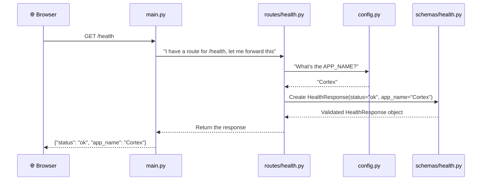

# Backend Skeleton — Beginner's Deep Dive

## The Big Picture

Your backend is a **web API** — a program that listens for HTTP requests (like a browser visiting a URL) and sends back data (usually JSON). Here's how the 4 files fit together:



Think of it like a restaurant:
- **main.py** = The restaurant itself (opens the doors, sets the name)
- **routes/health.py** = A waiter (takes an order, prepares the response)
- **schemas/health.py** = The menu format (defines what the response looks like)
- **config.py** = The restaurant's settings (name, environment, etc.)

---

## File 1: [config.py](file:///d:/Projects/Personal%20projects/AI_Search_Engine/backend/app/core/config.py) — The Settings Manager

```python
from pydantic_settings import BaseSettings, SettingsConfigDict
```

> **What's `pydantic_settings`?** It's a library that lets you define app settings as a Python class with **type validation**. If someone sets `APP_NAME` to a number instead of a string, it'll catch that error.

```python
class Settings(BaseSettings):
    APP_NAME: str = "Cortex"
    ENV: str = "development"
```

> **What's happening here?**
> - You're creating a class called `Settings` that **inherits from** `BaseSettings` (gets all its superpowers)
> - `APP_NAME: str = "Cortex"` means: "I have a setting called APP_NAME. It must be a string. If nobody provides a value, default to 'Cortex'."
> - `ENV: str = "development"` — same idea, defaults to "development"
>
> **The magic:** `BaseSettings` automatically looks for **environment variables** with these names. If you set `APP_NAME=MyCoolApp` in your `.env` file or system environment, it will use that instead of "Cortex". You don't write any code to read env vars — it just happens.

```python
    model_config = SettingsConfigDict(
        env_file=".env",
        env_file_encoding="utf-8",
        extra="ignore",
    )
```

> **What's `model_config`?** This configures HOW settings are loaded:
> - `env_file=".env"` → "Read settings from a file called `.env` in the project directory"
> - `env_file_encoding="utf-8"` → "Read that file as UTF-8 text"
> - `extra="ignore"` → "If the `.env` file has extra variables I didn't define (like `DATABASE_URL`), don't crash — just ignore them"

```python
settings = Settings()
```

> **This creates ONE instance** of the Settings class. When this line runs, Pydantic:
> 1. Checks the `.env` file for values
> 2. Checks system environment variables
> 3. Falls back to defaults ("Cortex", "development")
>
> Now `settings.APP_NAME` gives you `"Cortex"` (or whatever is in `.env`)

### Why not just hardcode values?

Because in production you'll want different settings (different API keys, database URLs, etc.) without changing code. You just change the `.env` file.

---

## File 2: [health.py (schema)](file:///d:/Projects/Personal%20projects/AI_Search_Engine/backend/app/schemas/health.py) — The Response Shape

```python
from pydantic import BaseModel
```

> **What's `pydantic.BaseModel`?** It's like a strict blueprint for data. You define what fields something should have and what types they must be.

```python
class HealthResponse(BaseModel):
    status: str
    app_name: str
```

> **This says:** "A health response is an object with exactly two fields: `status` (a string) and `app_name` (a string)."
>
> When FastAPI uses this schema, two things happen:
> 1. **Validation** — If you accidentally return `status=123`, FastAPI catches the error
> 2. **Serialization** — It automatically converts this Python object to JSON:
> ```json
> {
>     "status": "ok",
>     "app_name": "Cortex"
> }
> ```
>
> 3. **Documentation** — FastAPI auto-generates API docs (Swagger UI at `/docs`) that show this exact response shape

### Why not just return a plain dictionary?

You could do `return {"status": "ok"}` — but then:
- No validation (typos like `staus` wouldn't be caught)
- No auto-generated docs
- Other developers can't see the "contract" of your API at a glance

---

## File 3: [health.py (route)](file:///d:/Projects/Personal%20projects/AI_Search_Engine/backend/app/api/routes/health.py) — The Request Handler

```python
from fastapi import APIRouter
```

> **What's `APIRouter`?** Think of it as a **mini-app** that groups related routes. Instead of putting ALL your routes in `main.py` (which would get messy), you create separate routers for different features (health, search, auth, etc.)

```python
from app.core.config import settings
from app.schemas.health import HealthResponse
```

> **Importing from your own code:**
> - `settings` — the settings object we created in config.py (to get `APP_NAME`)
> - `HealthResponse` — the schema that defines the response shape

```python
router = APIRouter()
```

> **Creates the router instance.** Routes will be registered on this object.

```python
@router.get("/health", response_model=HealthResponse)
def health_check() -> HealthResponse:
    return HealthResponse(
        status="ok",
        app_name=settings.APP_NAME,
    )
```

> Let's break this down piece by piece:
>
> **`@router.get("/health", ...)`** — This is a **decorator**. It tells FastAPI: "When someone sends a GET request to `/health`, run the function below."
> - `GET` is an HTTP method (like visiting a URL in your browser)
> - `"/health"` is the URL path
> - `response_model=HealthResponse` tells FastAPI to validate and document the response using the schema
>
> **`def health_check() -> HealthResponse:`** — A normal Python function. The `-> HealthResponse` is a **type hint** saying "this function returns a HealthResponse."
>
> **`return HealthResponse(...)`** — Creates a HealthResponse object with:
> - `status="ok"` — the API is alive
> - `app_name=settings.APP_NAME` — pulls "Cortex" from our settings

### What's a health check endpoint?

It's a standard practice in web development. Monitoring tools, load balancers, and deployment systems periodically hit `/health` to check: "Is this server alive?" If they get `{"status": "ok"}`, everything's fine. If they get no response, the server is down.

---

## File 4: [main.py](file:///d:/Projects/Personal%20projects/AI_Search_Engine/backend/app/main.py) — The Entry Point

```python
from fastapi import FastAPI
```

> **`FastAPI`** is the main application class. This is the "restaurant" itself.

```python
from app.api.routes.health import router as health_router
from app.core.config import settings
```

> **Importing:**
> - `router as health_router` — imports the router from the health routes file and renames it to `health_router` (so if you later have `search_router`, `auth_router`, etc., the names don't clash)
> - `settings` — to get the app name

```python
app = FastAPI(title=settings.APP_NAME)
```

> **Creates the FastAPI application.** The `title` parameter sets the name shown in the auto-generated API docs at `/docs`. It reads "Cortex" from settings.

```python
app.include_router(health_router)
```

> **Registers the health router** with the main app. This is what connects the `/health` endpoint to the application. Without this line, the health route would exist in code but wouldn't be reachable.
>
> As you build more features, you'll add more lines like:
> ```python
> app.include_router(search_router, prefix="/api/v1")
> app.include_router(auth_router, prefix="/api/v1")
> ```

---

## How It All Connects (The Request Flow)

When someone visits `http://localhost:8000/health`:



---

## The Folder Structure — Why So Many Files?

```
backend/
├── app/
│   ├── __init__.py          ← Makes 'app' a Python package (can be empty)
│   ├── main.py              ← Entry point
│   ├── api/
│   │   ├── __init__.py      ← Makes 'api' a package
│   │   └── routes/
│   │       ├── __init__.py  ← Makes 'routes' a package
│   │       └── health.py    ← Health endpoint
│   ├── core/
│   │   ├── __init__.py      ← Makes 'core' a package
│   │   └── config.py        ← Settings
│   └── schemas/
│       ├── __init__.py      ← Makes 'schemas' a package
│       └── health.py        ← Response models
└── requirements.txt         ← Dependencies list
```

> **Why `__init__.py` files?** They tell Python "this folder is a package" — which is what allows `from app.core.config import settings` to work. Without them, Python wouldn't know to look inside these folders for modules.
>
> **Why not just one big file?** This structure follows the **separation of concerns** principle. Each folder has a clear purpose. When Cortex grows to have search, crawling, auth, etc., you'll add files to these folders without touching existing code.

---

## Running the Server

To actually start this, you'd run (from the `backend/` directory, with venv active):
```bash
uvicorn app.main:app --reload
```

- `app.main` → the file `app/main.py`
- `:app` → the `app = FastAPI(...)` variable inside that file
- `--reload` → auto-restart when you save changes (dev only)

Then visit:
- `http://localhost:8000/health` → your health endpoint
- `http://localhost:8000/docs` → auto-generated interactive API docs (Swagger UI)
